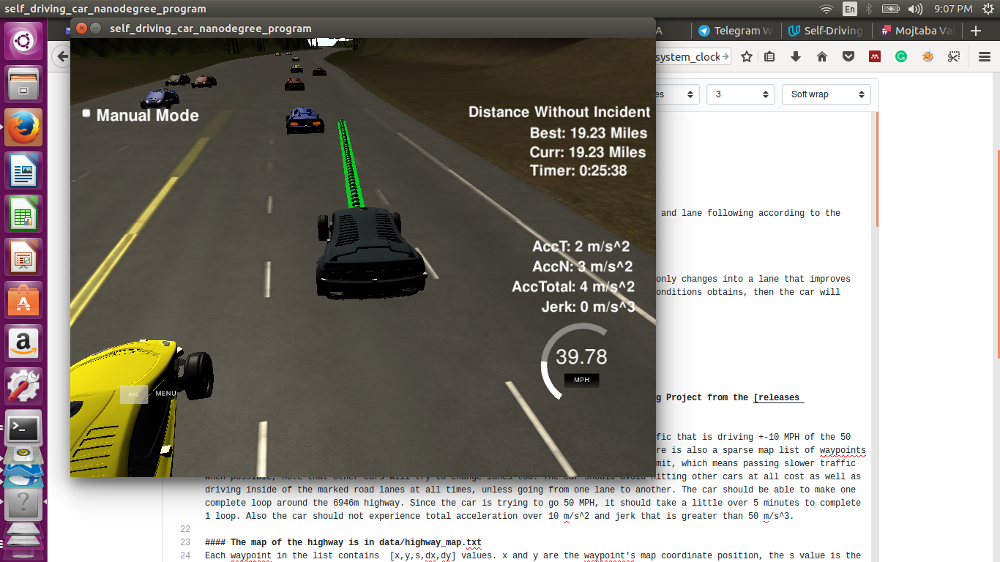
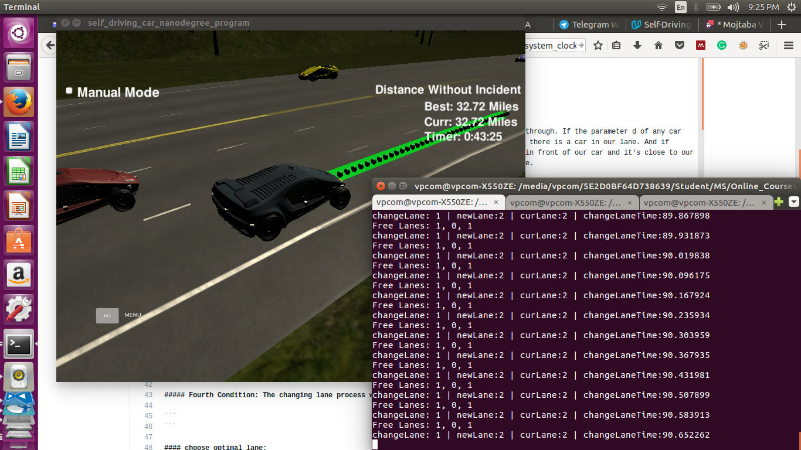
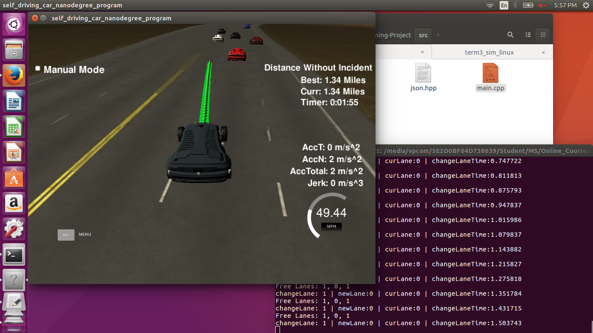

# CarND-Path-Planning-Project
Self-Driving Car Engineer Nanodegree Program

# Reflection: 

## Lane Following:

I used the same approach in project walkthrough for acceleration, jerk, speed limitation and lane following according to the Frenet system and Spline technique.  However I will explain it, briefly. For the speed limitaion, a variable will keep the maximum limitation and based on that, the car will choose to increase the car speed or not. 
```
double velSmoothParam = .224;
double interestedVel = 49.5;
if (too_close){
   ref_vel -= velSmoothParam;
}
else if (ref_vel < interestedVel){
   ref_vel += velSmoothParam;
}
```
To make the car going smooth without acceleration and jerk, the car speed will increase or decrease by 0.224 in each cycle. Waypints will be generated by a spline. Five points will be used as a reference points. Two previous points and 3 new points ahead of the ego car -30 meter spaced points ahead of the starting reference- were utilized to calculate the spline.

## Trajectory:

The trajectory I've used in this project is based on a spline that starts from some reference positions. If there is a previous path, then easily we will choose two waypoints so will not face any discontinuity in the spline. Otherwise, the car current position and another previous position will be utilized. After that, based on numberWaypoints some future waypoints ahead of the reference positions will be difined. 
```
double aheadSpaceParam = 30;
double numberWaypoints = 3;
for (int i = 0; i < numberWaypoints; i++){
	vector<double> next_wp = getXY(car_s + (i+1)*aheadSpaceParam, (2+4*lane), map_waypoints_s, map_waypoints_x, map_waypoints_y);
	ptsx.push_back(next_wp[0]);
	ptsy.push_back(next_wp[1]);
}
```
All points in ptsx and ptsy will be converted into our car cooridinates with zero heading along the x-axis. 
```
for (int i = 0; i < ptsx.size(); i++){
	// shift car reference angle to 0 degrees
	double shift_x = ptsx[i] - ref_x;
	double shift_y = ptsy[i] - ref_y;
	// rotation
	ptsx[i] = (shift_x*cos(0-ref_yaw)-shift_y*sin(0-ref_yaw));
	ptsy[i] = (shift_x*sin(0-ref_yaw)+shift_y*cos(0-ref_yaw));
}
```
Now, we have the trajectory and based on the following spline, we will calculate the y position of our car for 30 meter ahead. Based on that and previous points, the path planner will be filled up. Total 50 waypoints always will be used. These waypoints will be converted back to our ego car before following any path.
```
// create a spline 
tk::spline s;

// set (x,y) points to the spline 
s.set_points(ptsx, ptsy);
```

## Behaviour planner: 

My objective was creating a path planner that performs optimized lane changing -the car only changes into a lane that improves its forward progress- so, I used the following approach to change lanes. If these four conditions obtains, then the car will start the lane changing process:
   * There is a car in front of our car
   * Changing lane is possible 
   * New lane is not same as the current lane
   * The changing lane process was not happened recently
   
```
if(too_close && changeLane && newLane!=lane && condition){
         // start changing lane to the optimized one
         lane = newLane; // change to new lane :D 
         
         // save the time
         changeLaneTimeStamp = std::chrono::system_clock::now();

         // reset lanes speeds
         for (int i = 0; i < numLanes; i++) {
            laneSpeeds[i] = 1000;
         }

         too_close = false;
}
```
   
To find out how each condition was determined, please follow these guideline:

##### First Condition: There is a car in front of our car
Easily, using the Frenet coordinate system, I used the same approach in the project walkthrough. If the parameter d of any car that was obtained by sensor fusion system was between (2+4*lane-2) and (2+4*lane+2) then there is a car in our lane. And if (check_car_s > ego_car_s) and ((check_car_s-ego_car_s) < 30) satisfied then this car is in front of our car and it's close to our car (something between 0 and 30 meter) so the first condition is true, otherwise is false. 
```
if (d<(2+4*lane+2) && d > (2+4*lane-2)){
   check_car_s += ((double)prev_size*timeStep*check_speed); // if using previous points can project s value out
   // check s values greater than mine and s gap
   if ((check_car_s > car_s) && ((check_car_s-car_s) < warnAheadCar)){
      too_close = true;
   }
}
```

##### Second Condition: Changing lane is possible
First, I will check if there is a free lane using sensor fusion data and if there is the flag for changing lane will be set. 
```
changeLane = !std::all_of(freeLanes.begin(), freeLanes.end(), [](bool elm) { return elm==false; });  // lane change is possible 
```
However, the question is how can I find out a lane is free or not. For this, I utilized the following approach. For each car determined by sensor fusion system, I will check a safety zone. If the distance between ego car and the other car was dangerous then the lane of the other car will not be considered as free, otherwise if all cars was in the safe zone then that lane will be considred as a free lane. 
```
if( ((car_s-2*safeZone) < currentCarS && (car_s+safeZone) > currentCarS) ){
					freeLanes[carLane] = false; // lane is not free
}
```

##### Third Condition: New lane is not same as the current lane
It's the easiest part, you only need to use another variable for the new lane. 
```
if(newLane!=lane){
		...	
}
```
##### Fourth Condition: The changing lane process was not happened recently
Two variables keep the time for changing lane and the current time. Based on the different between this two variables, the time between each lane manoeuvre will be calculated. If this time was greater than 20 seconds, then the lane changing process is possible. I believe, for more optimality this 20 seconds can be smaller. 
```
currentTime = std::chrono::system_clock::now();
double changeCondTime = (currentTime-changeLaneTimeStamp).count()/1000000000.0; //s
bool condition = (changeCondTime)>20.0; // s
```

#### choose optimal lane:

To select an optimal path, I will calculate a lane speed. This speed calculated by checking speed of all the cars in that specific lane and choose the speed of the car which is lower than others. This shows the maximum speed of our car in that specific lane.
```
if(laneSpeeds[carLane] > carSpeed){
					laneSpeeds[carLane] = carSpeed;
}
```
Based on the ego car position, I will decide which lane is better to follow. If we are in the middle lane then we will face two choices for lane changing. Otherwise, there will be only one choice which is executable if it's free. In the middle lane case, the lane with more speed will be selected for following.
```
if(changeLane){
         // determine new lane according to lane speed 
         newLane = 0; // left lane is free
         newLane = 1; // middle lane is free
         newLane = 2; // right lane is free
         switch(lane) {
            case 0: // our car is in the left lane 
                  newLane = freeLanes[1] ? 1 : lane;
                  break;
            case 1: // our car is in the middle lane 
                  if(laneSpeeds[0] > laneSpeeds[2]){
                     if(freeLanes[0]){
                        newLane = 0;
                     }
                     else if(freeLanes[2]){
                        newLane = 2;
                     }
                  }else{
                     if(freeLanes[2]){
                        newLane = 2;
                     }
                     else if(freeLanes[0]){
                        newLane = 0;
                     }
                  }
                  //newLane = (laneSpeeds[0]>laneSpeeds[2])?(freeLanes[0] ? 0 : lane):(freeLanes[2] ? 2 : lane);
                  break;
            case 2: // our car is in the right lane 
                  newLane = freeLanes[1] ? 1 : lane;
                  break;
         }

} 
```
For passing the slower traffic, if there is a car in front or our car, the car will try to pass it as soon as possible if there is an adjacent free lane and lane changing process was not done less than 5 seconds ago. 




   
### Simulator. You can download the Term3 Simulator BETA which contains the Path Planning Project from the [releases tab](https://github.com/udacity/self-driving-car-sim/releases).

In this project your goal is to safely navigate around a virtual highway with other traffic that is driving +-10 MPH of the 50 MPH speed limit. You will be provided the car's localization and sensor fusion data, there is also a sparse map list of waypoints around the highway. The car should try to go as close as possible to the 50 MPH speed limit, which means passing slower traffic when possible, note that other cars will try to change lanes too. The car should avoid hitting other cars at all cost as well as driving inside of the marked road lanes at all times, unless going from one lane to another. The car should be able to make one complete loop around the 6946m highway. Since the car is trying to go 50 MPH, it should take a little over 5 minutes to complete 1 loop. Also the car should not experience total acceleration over 10 m/s^2 and jerk that is greater than 50 m/s^3.

#### The map of the highway is in data/highway_map.txt
Each waypoint in the list contains  [x,y,s,dx,dy] values. x and y are the waypoint's map coordinate position, the s value is the distance along the road to get to that waypoint in meters, the dx and dy values define the unit normal vector pointing outward of the highway loop.

The highway's waypoints loop around so the frenet s value, distance along the road, goes from 0 to 6945.554.

## Basic Build Instructions

1. Clone this repo.
2. Make a build directory: `mkdir build && cd build`
3. Compile: `cmake .. && make`
4. Run it: `./path_planning`.

Here is the data provided from the Simulator to the C++ Program

#### Main car's localization Data (No Noise)

["x"] The car's x position in map coordinates

["y"] The car's y position in map coordinates

["s"] The car's s position in frenet coordinates

["d"] The car's d position in frenet coordinates

["yaw"] The car's yaw angle in the map

["speed"] The car's speed in MPH

#### Previous path data given to the Planner

//Note: Return the previous list but with processed points removed, can be a nice tool to show how far along
the path has processed since last time. 

["previous_path_x"] The previous list of x points previously given to the simulator

["previous_path_y"] The previous list of y points previously given to the simulator

#### Previous path's end s and d values 

["end_path_s"] The previous list's last point's frenet s value

["end_path_d"] The previous list's last point's frenet d value

#### Sensor Fusion Data, a list of all other car's attributes on the same side of the road. (No Noise)

["sensor_fusion"] A 2d vector of cars and then that car's [car's unique ID, car's x position in map coordinates, car's y position in map coordinates, car's x velocity in m/s, car's y velocity in m/s, car's s position in frenet coordinates, car's d position in frenet coordinates. 

## Details

1. The car uses a perfect controller and will visit every (x,y) point it recieves in the list every .02 seconds. The units for the (x,y) points are in meters and the spacing of the points determines the speed of the car. The vector going from a point to the next point in the list dictates the angle of the car. Acceleration both in the tangential and normal directions is measured along with the jerk, the rate of change of total Acceleration. The (x,y) point paths that the planner recieves should not have a total acceleration that goes over 10 m/s^2, also the jerk should not go over 50 m/s^3. (NOTE: As this is BETA, these requirements might change. Also currently jerk is over a .02 second interval, it would probably be better to average total acceleration over 1 second and measure jerk from that.

2. There will be some latency between the simulator running and the path planner returning a path, with optimized code usually its not very long maybe just 1-3 time steps. During this delay the simulator will continue using points that it was last given, because of this its a good idea to store the last points you have used so you can have a smooth transition. previous_path_x, and previous_path_y can be helpful for this transition since they show the last points given to the simulator controller with the processed points already removed. You would either return a path that extends this previous path or make sure to create a new path that has a smooth transition with this last path.

## Tips

A really helpful resource for doing this project and creating smooth trajectories was using http://kluge.in-chemnitz.de/opensource/spline/, the spline function is in a single hearder file is really easy to use.

---

## Dependencies

* cmake >= 3.5
 * All OSes: [click here for installation instructions](https://cmake.org/install/)
* make >= 4.1
  * Linux: make is installed by default on most Linux distros
  * Mac: [install Xcode command line tools to get make](https://developer.apple.com/xcode/features/)
  * Windows: [Click here for installation instructions](http://gnuwin32.sourceforge.net/packages/make.htm)
* gcc/g++ >= 5.4
  * Linux: gcc / g++ is installed by default on most Linux distros
  * Mac: same deal as make - [install Xcode command line tools]((https://developer.apple.com/xcode/features/)
  * Windows: recommend using [MinGW](http://www.mingw.org/)
* [uWebSockets](https://github.com/uWebSockets/uWebSockets)
  * Run either `install-mac.sh` or `install-ubuntu.sh`.
  * If you install from source, checkout to commit `e94b6e1`, i.e.
    ```
    git clone https://github.com/uWebSockets/uWebSockets 
    cd uWebSockets
    git checkout e94b6e1
    ```

## Editor Settings

We've purposefully kept editor configuration files out of this repo in order to
keep it as simple and environment agnostic as possible. However, we recommend
using the following settings:

* indent using spaces
* set tab width to 2 spaces (keeps the matrices in source code aligned)

## Code Style

Please (do your best to) stick to [Google's C++ style guide](https://google.github.io/styleguide/cppguide.html).

## Project Instructions and Rubric

Note: regardless of the changes you make, your project must be buildable using
cmake and make!


## Call for IDE Profiles Pull Requests

Help your fellow students!

We decided to create Makefiles with cmake to keep this project as platform
agnostic as possible. Similarly, we omitted IDE profiles in order to ensure
that students don't feel pressured to use one IDE or another.

However! I'd love to help people get up and running with their IDEs of choice.
If you've created a profile for an IDE that you think other students would
appreciate, we'd love to have you add the requisite profile files and
instructions to ide_profiles/. For example if you wanted to add a VS Code
profile, you'd add:

* /ide_profiles/vscode/.vscode
* /ide_profiles/vscode/README.md

The README should explain what the profile does, how to take advantage of it,
and how to install it.

Frankly, I've never been involved in a project with multiple IDE profiles
before. I believe the best way to handle this would be to keep them out of the
repo root to avoid clutter. My expectation is that most profiles will include
instructions to copy files to a new location to get picked up by the IDE, but
that's just a guess.

One last note here: regardless of the IDE used, every submitted project must
still be compilable with cmake and make./
